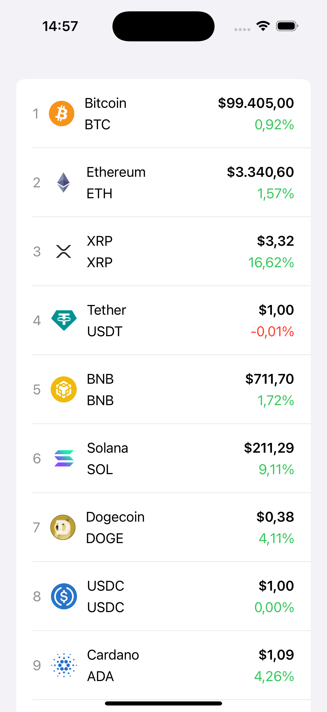

# Networking Crypto

A SwiftUI-based cryptocurrency tracking app that fetches real-time coin data using the CoinGecko API. This app demonstrates how to work with async/await, Swift's modern concurrency model, and implement effective error handling and pagination in a real-world scenario.

## Features

- Displays a list of top cryptocurrencies with their details:
  - Name
  - Symbol
  - Market Cap Rank
  - Current Price
  - 24-hour Price Change Percentage
- Fetches live data from the [CoinGecko API](https://www.coingecko.com/en/api).
- Asynchronous data fetching with **`async/await`**.
- Error handling to manage network or parsing issues gracefully.
- Pagination support for efficient data loading.

## Technologies Used

- **SwiftUI** for the user interface.
- **Combine** for state management.
- **URLSession** for networking.
- **JSONDecoder** for decoding API responses.

## Installation

1. Clone the repository:
   ```bash
   git clone https://github.com/YuriyIzbash/Networking_Crypto.git
   ```
2. Open the `Networking_Crypto.xcodeproj` file in Xcode.
3. Build and run the app on a simulator or a physical device.

## How It Works

1. The app fetches cryptocurrency data from the CoinGecko API using a `CoinDataService`.
2. Data is stored in a `CoinsViewModel` as an `ObservableObject` for easy state management.
3. The `ContentView` subscribes to the `CoinsViewModel` and displays the list of coins.
4. Error messages are shown as overlays if the API fails to respond or data cannot be decoded.

## API Details

The app uses the following API endpoint:
```
GET https://api.coingecko.com/api/v3/coins/markets?vs_currency=usd&order=market_cap_desc&limit=10
```

## Key Code Features

- **Error Handling**: Custom error enum `CoinAPIError` ensures all possible errors are handled gracefully.
- **Async/Await**: Simplified asynchronous code for fetching coins using `URLSession`.
- **Pagination**: Loads additional data when the user scrolls to the bottom of the list.

## Screenshots



## Future Enhancements

- Add search functionality for specific cryptocurrencies.
- Display historical data using charts.
- Enable user customization for tracked currencies.

## License

This project is licensed under the [MIT License](LICENSE).

## Credits

- Coin data provided by [CoinGecko](https://www.coingecko.com/).
